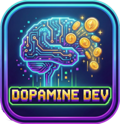

# Dopamine Dev

<div align="center">
  
  <h3>Gamify Your Coding Experience</h3>
</div>

---

**Coding is hard work.** Staying in the zone, fixing complex bugs, and writing clean code takes mental energy. **Dopamine Dev** turns your VS Code editor into a variable reward system, giving you instant, satisfying feedback for your productivity.

Think of it as a slot machine for your productivity: write code, save your file, and watch the status bar spin!

## Why use Dopamine Dev?

- **Instant Gratification:** Get visual feedback and coins for every significant code change.
- **Incentivize Quality:** Earn multipliers for fixing errors and writing clean code.
- **Track Productivity:** Measure your Flow State, WPM (Words Per Minute), and Daily Earnings.
- **Variable Rewards:** The unpredictability of "Jackpots" keeps your brain engaged and makes coding feel less like a chore.

---

## How It Works

### 1. The Core Loop
Just code as usual! Every time you save a file (`Cmd+S` / `Ctrl+S`), the extension analyzes your changes and spins the slot machine in your status bar.

### 2. Earning Coins
Not all saves are created equal. The amount you earn depends on **Magnitude**, **Speed**, and **Quality**.

| Mechanic | Trigger | Reward |
| :--- | :--- | :--- |
| **Base Reward** | Typing at least 20 characters | **1 Coin** |
| **Magnitude** | **Medium** Change (>5 lines / >100 chars) | **x2** Multiplier |
| | **Large** Change (>20 lines / >500 chars) | **x5** Multiplier |
| | **Epic** Change (>50 lines / >2000 chars) | **x10** Multiplier |
| **Flow State** | Coding continuously for >15 mins | **+1 Coin** (per 15m block) |
| **Speed** | Typing Fast (>40 WPM / >80 WPM) | **+2 / +5 Coins** |
| **Clean Code** | Saving a file with NO errors | **x1.5** Multiplier |
| **Bug Fixer** | Reducing the number of errors in a file | **x2.0** Multiplier |

### 3. Penalties (The "Anti-Bug" System)
To prevent you from just spamming broken code to earn coins, the system checks for errors:
*   **Introduced Bugs:** If you save a file and add *new* errors, you get **0 Coins**.
*   **Steady State Errors:** If you save a file that still has errors (even if you didn't add new ones), your reward is **halved (x0.5)**.

### 4. The Jackpot
Every spin has a random chance (default 10%) to trigger a **JACKPOT**.
*   **Effect:** Instantly awards **+10 Coins** (multiplied by your current modifiers!).
*   **Visuals:** Triggers a special sound effect and a visual reward (Quote, Image, or Message).

---

## Analytics & Economy

Your coins aren't just numbers—they tell the story of your coding day.

### The Wallet
*   **Persistent Balance:** Your coins are saved locally.
*   **Daily Reset:** To encourage a fresh start and daily habit building, your coin balance **resets to 0 at midnight**. Try to beat your high score!

### The Dashboard
We provide a beautiful visual dashboard to track your stats.
*   Run the command: `Show Dopamine Analytics`
*   **Bar Chart:** View your earnings (Green) vs. Spending (Red) over the last 7 days.
*   **History:** Click the coin count in the status bar to see a quick log of your recent wins and spends.

---

## Configuration

Customize the experience to fit your workflow in VS Code Settings (`Cmd+,` -> Search "Dopamine").

| Setting | Description | Default |
| :--- | :--- | :--- |
| `dopamineDev.winOdds` | Probability of hitting a Jackpot (0.0 - 1.0). | `0.1` (10%) |
| `dopamineDev.enableSound` | Enable satisfying "cha-ching" sounds on wins. | `false` |
| `dopamineDev.bulkThreshold` | Large chunks of text (pastes) don't count as "typing". | `50` chars |
| `dopamineDev.rewards` | Customize what happens on a Jackpot (Quotes, Images, URLs). | Quotes |
| `dopamineDev.quoteDisplay` | Show quotes as a subtle `notification` or a full `tab`. | `notification` |
| `dopamineDev.ignoreExtensions`| Files to ignore (e.g. JSON, LOG). | `['.json']` |

### Custom Rewards Example
Want to open a funny GIF or get a specific message when you hit a Jackpot? Add this to your `settings.json`:

```json
"dopamineDev.rewards": [
    {
        "type": "image",
        "content": "kitten", 
        "label": "Cute Cat",
        "weight": 2
    },
    {
        "type": "message",
        "content": "Drink some water!",
        "label": "Hydration Check",
        "weight": 1
    },
    {
        "type": "url",
        "content": "https://www.youtube.com/watch?v=dQw4w9WgXcQ",
        "label": "Mystery Link",
        "weight": 0.5
    }
]
```

---

## Commands

Access these via the Command Palette (`Cmd+Shift+P` / `Ctrl+Shift+P`):

*   `Show Dopamine Analytics`: Open the visual bar chart dashboard.
*   `Show Dopamine History`: Open a quick dropdown of your recent transactions.
*   `Check Dopamine Balance`: Show a simple notification with your current balance.
*   `Show Dopamine Transaction Log`: Open the raw JSON log file (for data nerds).

---

## Privacy & Data
*   All data (coins, history, settings) is stored **locally** on your machine.
*   No code or telemetry is sent to any external server.

---

**Enjoy coding again.**
*Install Dopamine Dev and start your streak today!*
